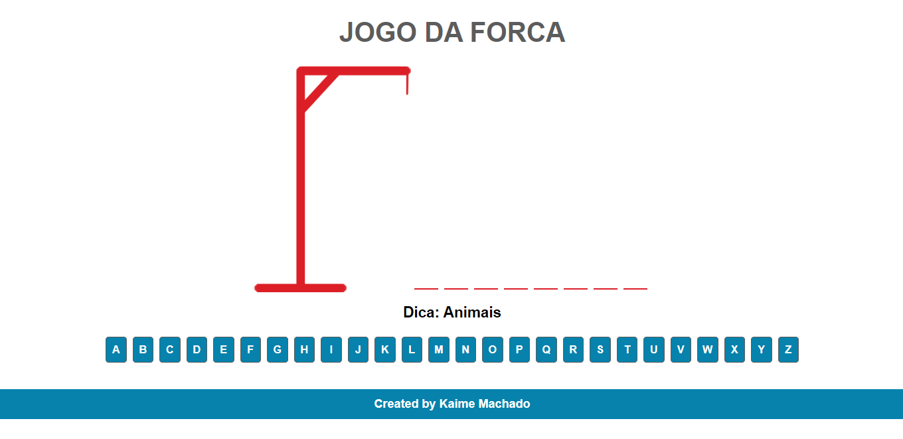
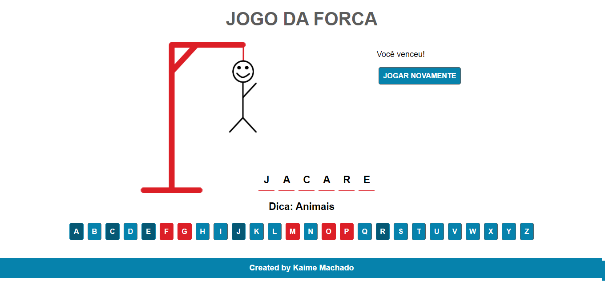

<h1>Olá, me chamo Kaime :)</h1>

<h2>E esse jogo foi desenvolvido como um desafio do projeto ONE (Alura + Oracle)
Onde faço parte da turma 03.</h2>

Esse projeto é um jogo da forca, usando HTML/CSS e JavaScript. Temos abaixo algumas demonstrações do jogo funcionando

<h1>Esse é o início do jogo</h1>

<h1>Quando o usuário errar</h1>

<h1>Quando o usuário vencer</h1>

<h3>Esse foi mais um projeto básico, onde consegui explorar alguns conhecimentos de html, css e javascript.</h3>